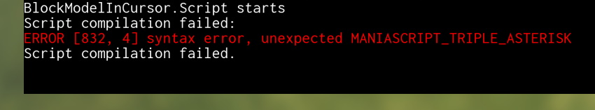
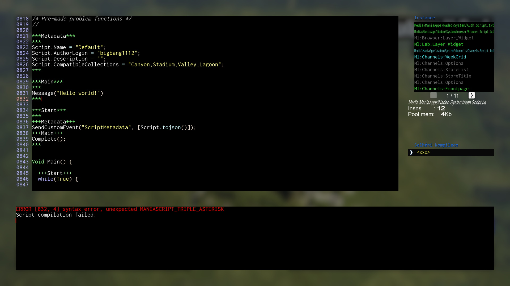
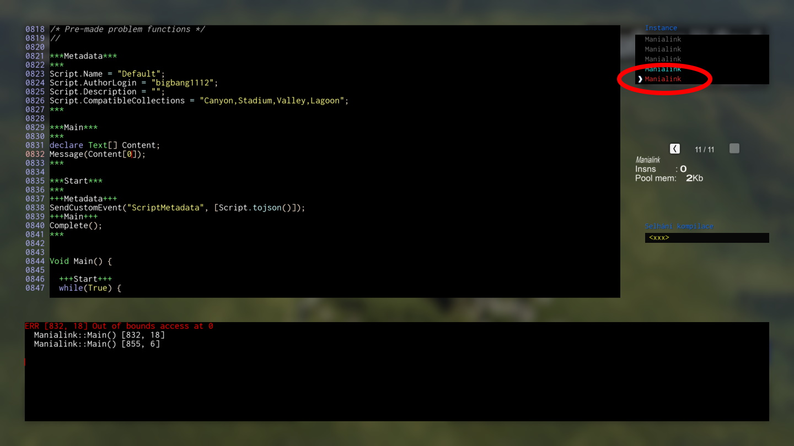
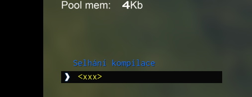

# Solving script errors

I've come across that the errors become often confusing when making the script. And there are surely things to keep in mind when scripting.

Modifier will let you know whenever the script has crashed via fancy message, which tells you to press Control+G twice. The first press of Control+G can tell you most of the time only error on some line number and the usually very random error message:

**The error line number is false information compared to your actual line in your script.** This is why you should press it again so that **this** pops up:

Here you can see exactly where the error happens. If you don't see a familiar code at first, there are two ways where you can find the crashed script.

First one can be found in the top right box **only if the script fails during runtime**. If you scroll through enough, you may eventually find a red-colored text saying something like `Media`. That is your script.

Second one is found in the middle right box **anytime** at the end of the list, named `<xxx>`.

The nature of wrong lines in error scripts comes from a fact that modification scripts are merged with a standard base between structs and functions. The structs must be always first in the code which is the reason why the lines shift by several dozens - structs do take some amount of lines.